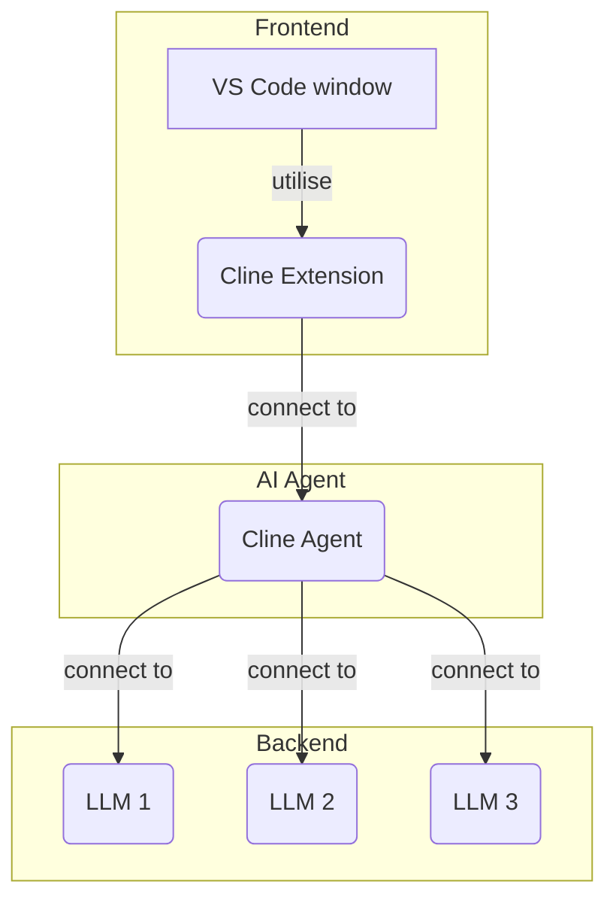

Generate ngsi-v2 MCP server:

agenterra scaffold mcp server --schema-path ./ngsi-mcp-servers/ngsiv2-openapi.json --project-name ngsi-v2-mcp --port 3300 --base-url http://localhost:1026

works for genration, but problem with parameters or attributes in openapi spec schema file, which are rust keywords, at compile time,

they need then to be escaped like: 'type' which must be preceded by 'r#' to become 'r#type' in rust code !
```
cd /Users/alaingaldemas/Documents/mcp
# then:
agenterra scaffold mcp server --schema-path ./ngsi-mcp-servers/ngsiv2-openapi.json --project-name ngsi-v2-mcp-2 --port 3300 --base-url http://localhost:1026
```

code is generated but at compile step:
```
error: expected identifier, found keyword `type`
  --> src/handlers/list_entities.rs:28:9
   |
20 | pub struct ListEntitiesParams {
   |            ------------------ while parsing this struct
...
28 |     pub type: Option<String>,
   |         ^^^^ expected identifier, found keyword
   |
help: escape `type` to use it as an identifier
   |
28 |     pub r#type: Option<String>,
   |         ++

error: expected identifier, found keyword `type`
  --> src/handlers/list_entities.rs:83:34
   |
83 |         if let Some(val) = &self.type {
   |                                  ^^^^ expected identifier, found keyword
   |
help: escape `type` to use it as an identifier
   |
83 |         if let Some(val) = &self.r#type {
```

   fixé le souci avec cline & gemini


## for ngsi-ld

agenterra scaffold mcp server --schema-path ./ngsi-mcp-servers/ngsi-ld-api.json --project-name ngsi-ld-mcp --port 3400 --base-url http://localhost:1026

agenterra scaffold mcp server --schema-path ./ngsi-mcp-servers/ngsi-ld-api.yaml --project-name ngsi-ld-mcp --port 3400 --base-url http://localhost:1026


cd agenterra && cargo run --release -- scaffold mcp server --schema-path ../ngsi-mcp-servers/ngsi-ld-api.json --project-name ngsi-ld-mcp --port 3400 --base-url http://localhost:1026 --output-dir ../ngsi-ld-mcp

cd /Users/alaingaldemas/Documents/mcp-openapi/agenterra

RUST_LOG=debug RUST_BACKTRACE=1 cargo run -- scaffold mcp server --schema-path ../ngsi-mcp-servers/ngsi-ld-api.yaml --project-name ngsi-ld-mcp-yml --port 3400 --base-url http://localhost:1026 > agenterra_debug_output.log 2>&1




modify to yaml the json to see influence, add some missing methods like '/types' ....
and regenerate code:
agenterra scaffold mcp server --schema-path ./ngsi-mcp-servers/ngsi-ld-api-simple.yaml --project-name ngsi-ld-mcp --port 3300 --base-url http://localhost:1026

ok but still have to fix 'rtype' with 'r#type' when in rust code or  'type' when used in string like descriptions of parameters....
with the modifications we add to fix #109 issue from agenterra
(agenterra, captured the 'type' as a keyword but rename to 'rtype' instead of 'r#type' when in code, and keep 'type' in descriptions...something to fix with cline)


cd /Users/alaingaldemas/Documents/mcp-openapi/agenterra && cargo run --release -- scaffold mcp server --schema-path ../ngsi-mcp-servers/ngsi-ld-api-simple.yaml --project-name ngsi-ld-mcp --port 3400 --base-url http://localhost:1026 --output-dir ../


cd /Users/alaingaldemas/Documents/mcp-openapi/agenterra && RUST_LOG=debug RUST_BACKTRACE=1 cargo run -- scaffold mcp server --schema-path ../ngsi-mcp-servers/ngsi-ld-api.yaml --project-name ngsi-ld-mcp-full --port 3400 --base-url http://localhost:1026 > agenterra_debug_output_new.log 2>&1


cd /Users/alaingaldemas/Documents/mcp-openapi/agenterra && RUST_LOG=debug RUST_BACKTRACE=1 cargo run -- scaffold mcp server --schema-path ../ngsi-mcp-servers/ngsi-ld-api-simple.yaml --project-name ngsi-ld-mcp --port 3400 --base-url http://localhost:1026/ngsi-ld/v1 --output-dir ../ > agenterra_debug_output_new.log 2>&1


cd /Users/alaingaldemas/Documents/mcp-openapi/agenterra && RUST_LOG=debug RUST_BACKTRACE=1 cargo run -- scaffold mcp server --schema-path ../ngsi-mcp-servers/ngsi-ld-api.yaml --project-name ngsi-ld-mcp-2 --port 3400 --base-url http://localhost:1026/ngsi-ld/v1 --output-dir ../ > agenterra_debug_output_new.log 2>&1

