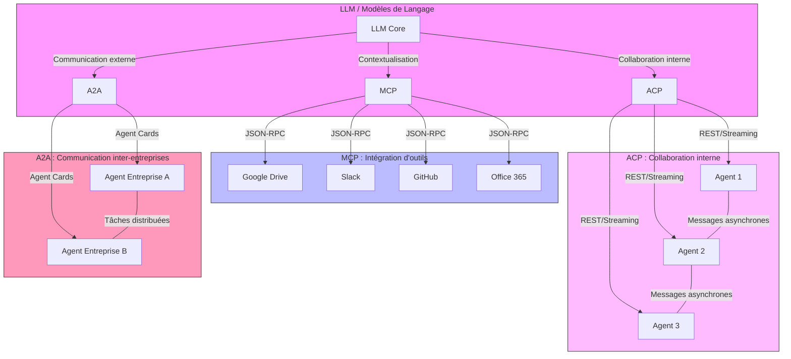

# Blueprint agentic AI protocols: MCP, A2A, ACP

# Comparison

| Criteria                | MCP (Model Context Protocol)                                      | A2A (Agent-to-Agent)                                      | ACP (Agent Communication Protocol)                                      |
|-------------------------|-------------------------------------------------------------------|-----------------------------------------------------------|-----------------------------------------------------------------------|
| Origin                  | Developed by Anthropic, launched in late 2024                   | Supported by Google and Microsoft, open standard           | Developed by IBM Research, BeeAI framework                            |
| Main Objective          | Standardize communication between LLMs and external tools (APIs, data) | Enable direct and secure communication between agents from different companies | Facilitate semantic and asynchronous collaboration between agents within an organization |
| Communication Mode      | Client-server interface (JSON-RPC)                                | Peer-to-peer (P2P), based on "Agent Cards"                 | Performative messages, REST-native, asynchronous streaming           |
| Typical Use Case        | Integration of business tools (Google Drive, Slack, GitHub, etc.) | Inter-company workflows, distributed task orchestration   | Internal collaboration, distributed decision-making, environments requiring enhanced security |
| Security                | Authentication and authorization via JSON-RPC, secure for accessing external tools | Agent Cards for authentication and capability discovery   | REST architecture, local data control, built-in observability        |

# Fundamental Differences Between MCP, A2A, and ACP

---

#### 1. **MCP (Model Context Protocol)**
- **Primary Role**:
  Standardize communication between **LLMs (language models)** and **external tools** (APIs, databases, cloud services).

- **Approach**:
  - **Client-server** (JSON-RPC): The LLM acts as a client calling external tools in a secure and standardized way.
  - **Integration**: Avoids the need for custom connectors for each API.

- **Use Cases**:
  - Integration of business tools (Google Drive, Slack, GitHub, etc.).
  - Secure access to external data or features.

- **Advantages**:
  - Mature ecosystem, ready-to-use integrations.
  - Reduces development costs.

- **Limitations**:
  - Less suitable for complex agent collaboration.

---

#### 2. **A2A (Agent-to-Agent)**
- **Primary Role**:
  Enable **direct and secure communication between agents** from different companies or systems.

- **Approach**:
  - **Peer-to-peer (P2P)**: Agents communicate without a central intermediary, using "Agent Cards" (capability cards).
  - **Dynamic Discovery**: Agents expose their capabilities and authenticate each other.

- **Use Cases**:
  - Inter-company workflows (e.g., automating processes between partners).
  - Distributed task orchestration.

- **Advantages**:
  - Interoperability between heterogeneous systems.
  - Flexibility for multi-company partnerships.

- **Limitations**:
  - Complex implementation for smaller actors.
  - Requires rigorous permission management.

---

#### 3. **ACP (Agent Communication Protocol)**
- **Primary Role**:
  Facilitate **semantic and asynchronous collaboration between agents** within the same organization.

- **Approach**:
  - **Performative Messages**: Communication based on intentions and actions (e.g., "request," "response," "negotiation").
  - **REST-native and asynchronous streaming**: Suitable for distributed environments.

- **Use Cases**:
  - Internal collaboration (e.g., agents making decisions together).
  - Environments requiring enhanced security and observability.

- **Advantages**:
  - Semantic richness for complex interactions.
  - Local data control and compliance.

- **Limitations**:
  - Smaller ecosystem compared to MCP.
  - Requires local infrastructure.

---

### Summary of Key Differences

| Criteria                | MCP                          | A2A                          | ACP                          |
|-------------------------|------------------------------|------------------------------|------------------------------|
| **Communication Type**   | LLM ↔ External Tools         | Agent ↔ Agent (inter-company) | Agent ↔ Agent (intra-organization) |
| **Model**               | Client-server (JSON-RPC)      | Peer-to-peer (Agent Cards)   | Performative messages (REST/streaming) |
| **Scope**               | Tool Integration             | Cross-system Interoperability | Internal Collaboration         |
| **Security**            | JSON-RPC Authentication      | Agent Cards + Permissions    | REST Architecture + Local Control |
| **Maturity**            | Large Ecosystem              | Growing                      | Developing                   |

---

### When to Use Which?
- **MCP**: If you want to connect an LLM to external tools (e.g., automating tasks with GitHub).
- **A2A**: If you need agents from different companies to communicate (e.g., supply chain).
- **ACP**: If you seek secure, semantic internal collaboration (e.g., agents making decisions together).

### Concrete Use Cases for MCP, A2A, and ACP (2025)

---

#### **MCP (Model Context Protocol)**
- **Business Tool Integration:**
  - Connect AI agents to existing tools like **Microsoft Office, Google Workspace, CRM (Salesforce, HubSpot), GitHub, Slack** without custom development.
  - Example: An agent automatically generates reports in Google Sheets or updates tickets in a CRM based on user queries:refs[1-22,23].

- **Internal Workflow Automation:**
  - Extract data from an ERP, analyze it with an LLM, and trigger actions in other tools (e.g., send an email via Outlook, create a task in Jira):refs[3-22].

- **Sector-Specific Use Cases:**
  - **Finance:** Automate the collection and analysis of financial data from multiple sources (e.g., Bloomberg, internal databases) to generate reports or alerts:refs[5-23].
  - **Customer Support:** Integrate an AI agent with support tools (Zendesk, Intercom) to respond to customer queries in real time by accessing knowledge bases and ticket histories:refs[7-22].

---

#### **A2A (Agent-to-Agent)**
- **Inter-Company Collaboration:**
  - **Healthcare:** A2A agents enable healthcare providers from different regions to securely and asynchronously exchange medical data (e.g., patient record transfers between hospitals, with encryption and OAuth/JWT authorization). Data is transferred via systems like Kafka for traceability:refs[9-29].
  - **Supply Chain:** Orchestrate tasks between agents from different logistics partners (e.g., a manufacturer's agent communicates with a transporter's agent to track shipments in real time and adjust routes):refs[11-22,23].

- **Business Process Automation:**
  - **E-commerce:** An A2A agent at a retailer can automatically negotiate prices and delivery times with supplier agents, then update internal and external systems (e.g., ERP, payment platforms):refs[13-22].
  - **Social Media:** A2A agents collaborate to moderate content, detect trends or crises, and coordinate responses across multiple platforms (e.g., Twitter, Facebook, TikTok):refs[15-23].

---

#### **ACP (Agent Communication Protocol)**
- **Internal Collaboration and Decision-Making:**
  - **Complex Task Orchestration:** In a local environment (e.g., IBM's BeeAI), ACP agents collaborate to solve multi-step problems requiring fine coordination (e.g., industrial maintenance planning, production chain optimization):refs[17-22,25,31].
  - **Project Management:** ACP agents dynamically assign tasks to teams, track progress, and adjust priorities based on field feedback, all while keeping data internal for compliance:refs[19-25,30].

- **Sector-Specific Use Cases:**
  - **Banking/Insurance:** Automate underwriting or claims management processes, where multiple agents must validate steps, access sensitive databases, and make real-time decisions:refs[21-30].
  - **Research & Development:** Agents collaborate to simulate scenarios, analyze lab data, and propose hypotheses or experimental protocols:refs[23-25].

---

### Complementarity and Combined Examples
- **Full Example:**
  - An **MCP agent** extracts customer data from a CRM and ERP.
  - An **ACP agent** analyzes this data internally with other agents to detect opportunities or risks.
  - An **A2A agent** communicates with partner agents to negotiate contracts or deliveries, then updates internal systems via MCP:refs[25-22,25,30].

---

### Summary Table of Use Cases

| Protocol | Concrete Examples                                                                                     | Key Sectors                     |
|----------|-------------------------------------------------------------------------------------------------------|----------------------------------|
| **MCP**  | Report automation, CRM/ERP integration, automated customer support                                   | Finance, Support, IT, HR        |
| **A2A**  | Healthcare data exchange, collaborative supply chain, e-commerce negotiation, content moderation | Healthcare, Logistics, E-commerce, Media |
| **ACP**  | Maintenance orchestration, project management, banking underwriting, collaborative R&D             | Industry, Banking, Insurance, R&D |

- MCP is the most mature for now
---

---

# Compare with TM FORUM apis for AI

## TMF915 AI Management API: Features and Positioning vs MCP, A2A, ACP

---

#### **1. Primary Objective**
- **Governance and Management of AI Systems at Scale**:
  - The TMF915 API is designed to enable service providers to **govern AI systems throughout their lifecycle**, from design to retirement. The current version (v4.0) focuses primarily on managing **"model contracts"** during the operational phase:refs[1-47,48,49].
  - **Model Contracts**: These contracts document and enforce the dependencies, constraints, and rules required for an AI system to function correctly (e.g., model versions, authorized data sources, service levels):refs[3-49].

---

#### **2. Key Features**
- **AI Model Management**:
  - Deployment, monitoring, and updating of AI models in production.
  - Management of dependencies between models and external systems (e.g., databases, APIs).
- **Integration with Service Management Frameworks**:
  - Compatible with TM Forum’s **Business Process Framework (eTOM)**, particularly for network operations automation (e.g., service configuration, performance management, fault resolution):refs[5-50].
  - Used in projects like **Autonomous Networks** to automate 5G operations (e.g., fault detection, service quality analysis, resource optimization):refs[7-50,55].
- **Typical Use Cases**:
  - **Telecommunications**: Automation of 5G network management, predictive maintenance, resource optimization, and customer experience improvement:refs[9-50,55].
  - **Image Segmentation and Classification**: Example cited in documentation to illustrate specialized AI model management:refs[11-51].
  - **AIOps (AI for IT Operations)**: Proactive problem detection, alert correlation, preventive maintenance, and continuous service improvement:refs[13-55].

---
#### **3. Architecture and Standards**
- **RESTful API**: Compliant with TM Forum’s Open API standards, facilitating integration with other telecom systems and APIs.
- **Integration with ODA (Open Digital Architecture)**: Enables a modular and interoperable approach for AI systems in telecom environments:refs[15-56].

---

### **Comparison with MCP, A2A, and ACP**

| Criteria                | TMF915 (AI Management API)                                                                 | MCP (Model Context Protocol)                                      | A2A (Agent-to-Agent)                                      | ACP (Agent Communication Protocol)                                      |
|-------------------------|-------------------------------------------------------------------------------------------|-------------------------------------------------------------------|-----------------------------------------------------------|-----------------------------------------------------------------------|
| **Primary Objective**   | Governance and management of AI models at scale, especially in telecoms.                  | Standardize communication between LLMs and external tools.    | Direct and secure communication between agents from different companies. | Semantic collaboration between agents within an organization.       |
| **Application Domain**  | Telecom sector, network management, AIOps, AI operations automation.                    | Integration of business tools (CRM, ERP, cloud).                 | Inter-company workflows, supply chain, healthcare.         | Internal collaboration, distributed decision-making.               |
| **Technical Approach**  | RESTful API, integration with eTOM/ODA, model contract management.                       | Client-server (JSON-RPC), standardized connectors.               | Peer-to-peer (Agent Cards), asynchronous communication.   | Performative messages, REST-native, asynchronous streaming.        |
| **Typical Use Cases**   | 5G automation, AIOps, AI model management, image segmentation.                          | Report automation, CRM/ERP integration.                         | Healthcare data exchange, collaborative supply chain.      | Maintenance orchestration, internal project management.           |
| **Security**            | Compliant with telecom standards, contract and dependency management.                    | Authentication via JSON-RPC.                                     | Agent Cards + permissions, encryption (OAuth/JWT).          | REST architecture, local data control.                              |
| **Interoperability**    | Limited to telecom sector and ODA/eTOM-compatible systems.                                 | Broad ecosystem of business tools.                               | Designed for inter-company interoperability.              | Optimized for internal collaboration.                                |
| **Maturity**            | Mature in telecoms, but limited to specific use cases (e.g., 5G, AIOps).                  | Large and mature ecosystem.                                       | Growing, especially for B2B partnerships.                  | Developing, especially within frameworks like BeeAI.                |

---

### **When to Use TMF915 vs MCP/A2A/ACP?**
- **TMF915**:
  - If you work in **telecommunications**, network management (5G, AIOps), or large-scale AI model governance.
  - For use cases requiring **integration with eTOM/ODA** and fine-grained model contract management.
- **MCP**:
  - To connect **LLMs to external tools** (CRM, ERP, cloud) in a standardized way.
- **A2A**:
  - For **collaborative workflows between companies** (e.g., healthcare, logistics, e-commerce).
- **ACP**:
  - For **secure, semantic internal collaboration** (e.g., distributed decision-making, R&D).

---

### **Summary**
- **TMF915** is a specialized API for **AI model governance in telecoms**, focusing on model contracts and network operations automation. It complements protocols like MCP/A2A/ACP but is not designed for agent communication or generic tool integration.
- **MCP/A2A/ACP** are **generic, interoperable protocols** designed for diverse use cases (tool integration, inter-agent collaboration), while TMF915 remains rooted in telecom-specific AI model management.

---

# Emerging Agentic Protocols Beyond MCP, A2A, and ACP (2025)

---

#### **1. ANP (Agent Network Protocol)**
- **Purpose**:
  ANP aims to create **decentralized agent marketplaces**, where agents can autonomously discover, negotiate, and collaborate without a central coordinator. It is designed for open, dynamic ecosystems where agents can exchange services or data securely and transparently:refs[1-61,62,68].

- **Key Difference from MCP/A2A/ACP**:
  - **MCP**: Focuses on connecting LLMs to external tools.
  - **A2A**: Enables direct communication between agents from different organizations.
  - **ACP**: Facilitates internal collaboration between agents.
  - **ANP**: Goes further by enabling **decentralized discovery and negotiation** among autonomous agents.

---

#### **2. AGUI (Agentic Graphical User Interface)**
- **Purpose**:
  AGUI is an approach to standardize **user interfaces generated by agents**, allowing humans and agents to collaborate via dynamic, adaptive interfaces. This protocol is still under development but aims to make human-agent interactions more intuitive and customizable:refs[3-83].

- **Key Difference**:
  - AGUI focuses on **user interface**, while MCP/A2A/ACP focus on communication and integration between agents or tools.

---

#### **3. Function Calling and ReAct**
- **Purpose**:
  These frameworks (developed by OpenAI, Google, and others) allow LLMs to **dynamically call external functions** (APIs, tools) in a contextual manner. They are not full-fledged protocols but **interoperability mechanisms** that complement MCP, A2A, and ACP by enabling more flexible and responsive tool integration:refs[5-62].

- **Key Difference**:
  - **Function Calling** and **ReAct** are **execution mechanisms**, while MCP/A2A/ACP are communication and collaboration protocols.

---

#### **4. Kafka-Based and Event Streaming Protocols**
- **Purpose**:
  Infrastructures like **Apache Kafka** are increasingly used to provide a **shared memory layer** and real-time communication between agents. Kafka enables agents to react to events, share observations, and make decisions asynchronously and at scale:refs[7-69].

- **Key Difference**:
  - Kafka is not an agentic protocol itself but a **complementary infrastructure** that enhances MCP and A2A by adding a memory and coordination layer.

---

#### **5. Proprietary Protocols and Specific Frameworks**
- **Examples**:
  - **LangChain** and **LlamaIndex**: These frameworks provide mechanisms for orchestrating agents and tools, often relying on MCP or A2A for communication.
  - **AutoGen** (Microsoft): Enables the creation of conversational and collaborative agents, with mechanisms for task negotiation and delegation.
  - **BeeAI** (IBM): Uses ACP for internal collaboration but also offers extensions for specific use cases (e.g., business workflow management):refs[9-64,67].

---

### Summary Table of Protocols and Their Roles

| Protocol/Approach  | Main Role                                                                 | Key Difference from MCP/A2A/ACP                     |
|--------------------|---------------------------------------------------------------------------|-----------------------------------------------------|
| **ANP**              | Create decentralized marketplaces for autonomous agents.                 | Enables **decentralized discovery and negotiation** among agents. |
| **AGUI**             | Standardize user interfaces generated by agents.                         | Focuses on **human-agent interaction**.              |
| **Function Calling** | Dynamically call external functions.                                      | **Execution mechanism**,
| **ReAct**            | Enables LLMs to reason and act by calling external tools.                 | **Execution mechanism**, complements protocols.      |
| **Kafka-Based**      | Provides shared memory and real-time communication for agents.           | **Complementary infrastructure**, enhances protocols. |
| **Proprietary Frameworks** | Orchestrate agents and tools (e.g., LangChain, AutoGen).                 | **Frameworks**, often rely on existing protocols.    |

 

# Agent Network Protocol (ANP): Origins, Features, and Potential (2025)

---

#### **1. Origins**
- **Open-Source Initiative**: ANP is an open-source protocol developed by a community of researchers and engineers, aiming to create a **decentralized, open network for AI agents** [(GitHub - Agent Network Protocol)](https://github.com/agent-network-protocol/AgentNetworkProtocol) [(ANP Official Site)](https://agent-network-protocol.com/specs/white-paper.html) :refs[1-91,98,100].
- **Inspiration**: ANP is inspired by the need to break down digital silos and enable seamless, large-scale collaboration among AI agents, similar to how HTTP enabled the web. It is designed to be the **"HTTP of the Agentic Web era"** [(GitHub - Agent Network Protocol)](https://github.com/agent-network-protocol/AgentNetworkProtocol) [(ANP White Paper)](https://arxiv.org/abs/2508.00007) :refs[3-91,92].

---

#### **2. Key Features of ANP**

##### **Three-Layer Protocol Architecture**
ANP is structured into three layers, each addressing a specific challenge in agent interoperability:

1. **Identity and Encrypted Communication Layer**:
   - Provides **decentralized identity (DID)** and secure, encrypted communication between agents.
   - Ensures agents can authenticate and authorize interactions without relying on a central authority [(ANP White Paper)](https://arxiv.org/abs/2508.00007) [(Medium - ANP)](https://medium.com/@changshan/agent-network-protocol-technical-white-paper-towards-an-open-internet-of-agents-d2b558ed40a4) :refs[5-92,97].

2. **Meta-Protocol Negotiation Layer**:
   - Enables agents to dynamically negotiate communication protocols, data formats, and interaction rules.
   - Supports **multi-modal communication** (e.g., text, files, streams) and ensures compatibility across different agent frameworks [(ANP White Paper)](https://arxiv.org/abs/2508.00007) [(MarkTechPost - ANP)](https://www.marktechpost.com/2025/05/09/a-deep-technical-dive-into-next-generation-interoperability-protocols-model-context-protocol-mcp-agent-communication-protocol-acp-agent-to-agent-protocol-a2a-and-agent-network-protocol-anp/) :refs[7-92,96].

3. **Application Protocol Layer**:
   - Defines standardized entities such as **Agent Cards, Tasks, and Artifacts** for robust workflow orchestration.
   - Facilitates **modular, scalable, and interoperable** agent interactions [(ANP White Paper)](https://arxiv.org/abs/2508.00007) [(MarkTechPost - ANP)](https://www.marktechpost.com/2025/05/09/a-deep-technical-dive-into-next-generation-interoperability-protocols-model-context-protocol-mcp-agent-communication-protocol-acp-agent-to-agent-protocol-a2a-and-agent-network-protocol-anp/) :refs[9-92,96].

---

##### **Core Capabilities**
- **Decentralized Agent Discovery**:
  - Agents can discover and connect with each other across the open internet, without relying on centralized directories or closed platforms [(MarkTechPost - ANP)](https://www.marktechpost.com/2025/05/09/a-deep-technical-dive-into-next-generation-interoperability-protocols-model-context-protocol-mcp-agent-communication-protocol-acp-agent-to-agent-protocol-a2a-and-agent-network-protocol-anp/) [(ANP White Paper)](https://arxiv.org/abs/2508.00007) :refs[11-92,94].
- **Dynamic Negotiation and Capability Exchange**:
  - Agents can negotiate tasks, share capabilities, and collaborate in real time, even if they are built on different technologies [(ANP White Paper)](https://arxiv.org/abs/2508.00007) [(MarkTechPost - ANP)](https://www.marktechpost.com/2025/05/09/a-deep-technical-dive-into-next-generation-interoperability-protocols-model-context-protocol-mcp-agent-communication-protocol-acp-agent-to-agent-protocol-a2a-and-agent-network-protocol-anp/) :refs[13-92,96].
- **Trustless and Secure Communication**:
  - Uses cryptographic identity models and access control to ensure secure, authenticated interactions between agents [(ANP White Paper)](https://arxiv.org/abs/2508.00007) [(Medium - ANP)](https://medium.com/@changshan/agent-network-protocol-technical-white-paper-towards-an-open-internet-of-agents-d2b558ed40a4) :refs[15-92,97].
- **Interoperability with Existing Standards**:
  - Compatible with widely used internet protocols such as **OpenAPI, JSON-RPC, and WebRTC**, making it easier to integrate with existing systems [(ANP Official Site)](https://agent-network-protocol.com/specs/white-paper.html) [(Medium - ANP)](https://medium.com/@changshan/agent-network-protocol-technical-white-paper-towards-an-open-internet-of-agents-d2b558ed40a4) :refs[17-98,100].

---

#### **3. Potential of ANP**

##### **Enabling the "Internet of Agents"**
- ANP aims to create a **global, decentralized network of agents**, where agents act as nodes and structured data flows between them. This network could evolve into a dynamic, self-organizing ecosystem of AI services [(ANP White Paper)](https://arxiv.org/abs/2508.00007) [(Medium - ANP)](https://medium.com/@changshan/agent-network-protocol-technical-white-paper-towards-an-open-internet-of-agents-d2b558ed40a4) :refs[19-92,97].
- By enabling agents to **directly access and exchange capabilities and knowledge**, ANP liberates AI from the constraints of closed platforms and proprietary interfaces [(ANP White Paper)](https://arxiv.org/abs/2508.00007) :refs[21-97].

##### **Use Cases**
- **Autonomous AI Services**:
  - Personal agents, service agents, and search agents can connect and collaborate through ANP, forming a **global agent internet** that evolves dynamically [(ANP White Paper)](https://arxiv.org/abs/2508.00007) :refs[23-97].
- **Collective Intelligence**:
  - ANP enables agents to form **dynamic coalitions** to solve complex tasks, similar to swarm robotics or modular cognitive systems [(MarkTechPost - ANP)](https://www.marktechpost.com/2025/05/09/a-deep-technical-dive-into-next-generation-interoperability-protocols-model-context-protocol-mcp-agent-communication-protocol-acp-agent-to-agent-protocol-a2a-and-agent-network-protocol-anp/) :refs[25-96].
- **Cross-Domain Collaboration**:
  - Agents from different industries (e.g., healthcare, logistics, finance) can securely share data and capabilities, enabling **cross-domain innovation** [(MarkTechPost - ANP)](https://www.marktechpost.com/2025/05/09/a-deep-technical-dive-into-next-generation-interoperability-protocols-model-context-protocol-mcp-agent-communication-protocol-acp-agent-to-agent-protocol-a2a-and-agent-network-protocol-anp/) :refs[27-94].

##### **Advantages Over Existing Protocols**
- **Decentralization**:
  - Unlike MCP (focused on tool integration) or A2A (focused on inter-company collaboration), ANP is designed for **open, decentralized agent networks** [(MarkTechPost - ANP)](https://www.marktechpost.com/2025/05/09/a-deep-technical-dive-into-next-generation-interoperability-protocols-model-context-protocol-mcp-agent-communication-protocol-acp-agent-to-agent-protocol-a2a-and-agent-network-protocol-anp/) [(Survey of Agent Protocols)](https://arxiv.org/html/2505.02279v1) :refs[29-94,95].
- **Scalability**:
  - ANP’s architecture supports **large-scale agent collaboration**, making it suitable for global applications [(ANP White Paper)](https://arxiv.org/abs/2508.00007) [(MarkTechPost - ANP)](https://www.marktechpost.com/2025/05/09/a-deep-technical-dive-into-next-generation-interoperability-protocols-model-context-protocol-mcp-agent-communication-protocol-acp-agent-to-agent-protocol-a2a-and-agent-network-protocol-anp/) :refs[31-92,96].
- **Flexibility**:
  - ANP’s modular design allows it to adapt to diverse use cases, from internal enterprise workflows to open internet-scale agent networks [(MarkTechPost - ANP)](https://www.marktechpost.com/2025/05/09/a-deep-technical-dive-into-next-generation-interoperability-protocols-model-context-protocol-mcp-agent-communication-protocol-acp-agent-to-agent-protocol-a2a-and-agent-network-protocol-anp/) :refs[33-96].

---

#### **4. Comparison with MCP, A2A, and ACP**

| Feature                | ANP (Agent Network Protocol)                          | MCP (Model Context Protocol)               | A2A (Agent-to-Agent)                          | ACP (Agent Communication Protocol)          |
|------------------------|--------------------------------------------------------|---------------------------------------------|-----------------------------------------------|-----------------------------------------------|
| **Primary Focus**      | Decentralized agent discovery and collaboration      | LLM-to-tool integration                     | Inter-company agent communication             | Internal agent collaboration                 |
| **Communication Model**| Peer-to-peer, decentralized                           | Client-server (JSON-RPC)                    | Peer-to-peer (Agent Cards)                   | REST-native, asynchronous messaging         |
| **Use Cases**          | Open agent networks, collective intelligence          | Tool integration, workflow automation       | Cross-company workflows, supply chain        | Internal collaboration, decision-making      |
| **Security**          | Decentralized identity, cryptographic authentication | JSON-RPC authentication                     | Agent Cards, OAuth/JWT                        | REST architecture, local data control       |
| **Interoperability**  | Open, compatible with OpenAPI, JSON-RPC, WebRTC        | Broad ecosystem of business tools          | Designed for inter-company interoperability  | Optimized for internal collaboration         |
| **Scalability**       | Designed for global, decentralized networks           | Mature, tool-specific integrations         | Growing ecosystem for B2B partnerships      | Developing within frameworks like BeeAI      |

---

#### **5. Conclusion**
ANP represents a **paradigm shift** in how AI agents communicate and collaborate. By providing a **decentralized, open, and interoperable** framework, ANP has the potential to unlock new levels of **collective intelligence, scalability, and innovation** in the AI ecosystem. Its focus on **decentralized identity, dynamic negotiation, and cross-domain collaboration** sets it apart from existing protocols like MCP, A2A, and ACP, making it a key enabler for the future "Internet of Agents."
